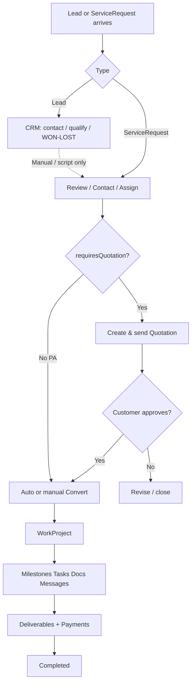
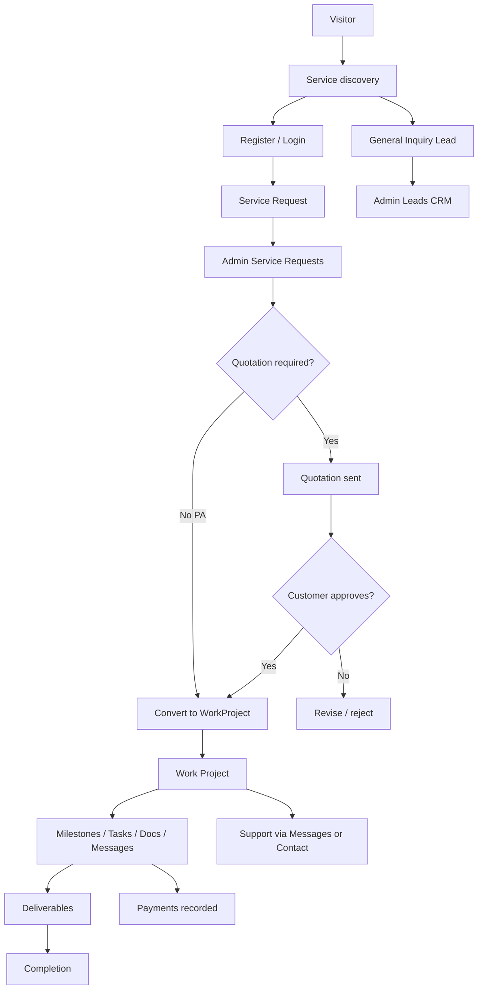

# Vignak Solutions — Application Feature & User Functionality Specification

**Document type:** Product / business / application specification (read-only analysis)  
**Date:** 2026-09-13  
**Source of truth:** Existing codebase (`client/`, `server/`, `shared/`)  
**Supporting docs (secondary):** `docs/UI_UX_DESIGN_AUDIT.md`, `docs/UI_UX_COMPLETION_REPORT.md`, `docs/START.md`, Part 2 audits  
**Scope rule:** No invented features. Implementation status is labeled explicitly. Secrets and private user data are not included.

---

## 1. Document Purpose

This specification explains **what Vignak Solutions currently does**, for:

- Product and business stakeholders  
- Developers and QA  
- Admins / staff operators  
- Future UX and service expansion planning  

It answers, for every major capability: **What? Why? Who? When? How? What happens next?**

It also separates:

| Layer | Meaning |
|-------|---------|
| **Current implementation** | Verified in code |
| **Intended / catalog design** | Present in shared catalog or UI copy |
| **Recommended canonical model** | Future-facing (Section 40) — does **not** overwrite current behavior |

---

## 2. Application Overview

**Name:** Vignak Solutions  
**Architecture:** MERN modular monolith (React + Vite client, Express API, MongoDB/Mongoose, `@vignak/shared` domain constants)  
**Auth:** JWT in httpOnly cookie `vignak_token` (default 7-day expiry)  
**Access control:** Role-based permissions for staff; ownership filters for customers (`role: USER`)

**Product positioning (current):** Multi-service business platform with **Project Assistance** as flagship. Catalog defines 13 service slugs with per-service request fields, milestones, quotation flags, and deliverable types.

**Primary operational chain (current):**

```text
LEAD  = Initial business/customer interest (CRM record; usually from General Inquiry form)
SERVICE REQUEST  = Formal request by a registered user for a catalog service
PROJECT (WorkProject)  = Approved work Vignak is actually executing
```

These three are **separate models** and must not be merged conceptually.

---

## 3. Product Concepts

### 3.1 Canonical definitions (business meaning)

| Concept | Meaning | Implementation status |
|---------|---------|----------------------|
| **Lead** | Someone expressed interest (brief, budget, preferred contact). Not yet formal tracked delivery work. | **FULLY** (create + admin CRM). No API convert→request. |
| **Inquiry** | Contact-form message (subject/body). Separate from Lead. | **FULLY** |
| **Service Request** | Registered user formally requests a service with structured fields. Trackable in dashboard. | **FULLY** |
| **Quotation** | Commercial proposal tied to a service request (required for most non-PA services before convert). | **FULLY** (core); expiry job **NOT IMPLEMENTED** |
| **Project / Work Project** | Delivery workspace created when staff convert an eligible request (or auto-convert after quote approve). | **FULLY** (create only via convert) |
| **Milestone** | Weighted checkpoint contributing to progress %. | **FULLY** |
| **Task** | Staff work item; may be `CLIENT` or `INTERNAL` visibility. | **FULLY** |
| **Document** | File attached to a work project (`clientVisible` gate). | **FULLY** |
| **Deliverable** | Output submitted for customer **approval** (distinct from Document). | **FULLY** (client decide); staff resubmit loop **PARTIAL** |
| **Message** | Thread on a work project (`CLIENT` / `INTERNAL`). | **FULLY** |
| **Payment** | Payment record on a project (admin-recorded / webhook). | **PARTIAL** (no customer checkout) |
| **Notification** | In-app event for a user. | **FULLY** (in-app); email ops mail **NOT IMPLEMENTED** |
| **Support** | Dashboard help page with links — **not** a ticketing system. | **UI ONLY** |
| **Portfolio Project** | Public CMS case-study content (not a WorkProject). | **FULLY** (CMS) |
| **Talk** | Public event content + optional registration. | **FULLY** |

### 3.2 Critical distinctions (confusion hotspots)

```text
LEAD
= Initial business/customer interest
→ Model: Lead | Typical source: /start-project (General Inquiry)
→ Customer does NOT track this in the modern dashboard as a “request”
→ Admin manages under Leads

SERVICE REQUEST
= Formal request for a service by a logged-in user
→ Model: ServiceRequest | Source: /dashboard/requests/new
→ Customer tracks status under Requests
→ Does NOT automatically create a Project

PROJECT (WorkProject)
= Approved work Vignak is actually executing
→ Created only when staff Convert (or quotation approve auto-convert)
→ Customer sees under Projects with milestones, docs, messages
```

**“Start Your Project”** is a **marketing CTA label**, not a single backend action. Depending on surface it may mean: register, open new tracked request, or open General Inquiry (`/start-project`).

**“Projects” (admin Portfolio)** ≠ **“Client projects” (Work Projects)**.

---

## 4. User Roles

### Roles actually implemented (`shared/roles.js`)

| Role | Purpose | Auth | Dashboard |
|------|---------|------|-----------|
| **Guest / Visitor** | Browse public site; submit Lead/Contact; register | No | None |
| **USER** | Customer portal (students + other customer types) | Yes | `/dashboard` |
| **STAFF** | Delivery team member | Yes | `/admin` (permission-filtered) |
| **SALES** | Lead/request commercial ops | Yes | `/admin` |
| **CONTENT_MANAGER** | Portfolio/Talks/services CMS | Yes | `/admin` |
| **ADMIN** | Broad operations | Yes | `/admin` |
| **SUPER_ADMIN** | All permissions | Yes | `/admin` |

### Customer type (not a role)

`User.customerType` (`STUDENT`, `INDIVIDUAL`, `BUSINESS`, `STARTUP`, `COLLEGE`, `INSTITUTION`, `EVENT_ORGANIZER`, `ORGANIZATION`) segments customers. It does **not** grant staff permissions. Default on register: `STUDENT`.

**Student vs Client:** Same `role: USER`. UI differences are mostly progressive nav (commercial sections) and self-selected `customerType`. There is **no separate Client role**.

### Role: Guest / Visitor

| Aspect | Detail |
|--------|--------|
| **Who** | Anyone without session |
| **Enter** | Public URLs |
| **Can** | View marketing pages; submit Lead (`/start-project`); submit Contact; register/login; register for talks (public API) |
| **Cannot** | Access `/dashboard/*` or `/admin/*`; create ServiceRequest |
| **Creates** | Lead, Inquiry, TalkRegistration, User (via register) |

### Role: USER (Student / Client customer)

| Aspect | Detail |
|--------|--------|
| **Who** | Registered customer |
| **Enter** | Register or Login |
| **Dashboard** | `DashboardLayout` — Overview, Requests, Projects, optional commercial, Notifications, Profile, Support |
| **Permissions** | Empty staff permission list; access via **ownership** |
| **Can create** | ServiceRequest; project Messages; profile updates; quotation approve/reject; deliverable approve/request-changes |
| **Cannot** | Convert requests; assign staff; upload project documents; create quotations/payments; access other users’ data |
| **Typical workflow** | Register → New request → Wait for review → (optional quote) → Project appears → Collaborate → Approve deliverables |

### Role: STAFF

| Aspect | Detail |
|--------|--------|
| **Who** | Delivery assignees |
| **Permissions** | Delivery ops without lead/SR assign; no users/settings write typically |
| **Scope** | Often limited to `assignedTo` / `assignees` |
| **Can** | Update assigned SRs/projects; milestones; tasks; docs; messages; deliverables; read quotes/payments |

### Role: SALES

| Aspect | Detail |
|--------|--------|
| **Who** | Commercial intake |
| **Can** | Leads R/W/Assign; SR R/W/Assign; quotations R/W; work projects **read**; payments **read** |

### Role: CONTENT_MANAGER

| Aspect | Detail |
|--------|--------|
| **Who** | Marketing CMS |
| **Can** | Portfolio projects, talks, speakers, services content/config — **not** full delivery CRM |

### Role: ADMIN / SUPER_ADMIN

| Aspect | Detail |
|--------|--------|
| **Who** | Operators |
| **ADMIN** | Broad delivery + CMS + users + settings + audit |
| **SUPER_ADMIN** | All `PERMISSIONS` values |

**Staff creation:** Customers cannot self-elevate. Staff users created via Admin Users (`POST /api/admin/users`).

---

## 5. Role Responsibility Summary

| Responsibility | Guest | USER | STAFF | SALES | CONTENT | ADMIN+ |
|----------------|:----:|:----:|:-----:|:-----:|:-------:|:------:|
| Public browse | ✓ | ✓ | ✓ | ✓ | ✓ | ✓ |
| Create Lead / Contact | ✓ | ✓ | — | — | — | — |
| Create Service Request | ✗ | ✓ | ✗* | ✗* | ✗ | ✗* |
| Manage Leads | ✗ | R own API** | R/W | R/W/A | ✗ | R/W/A |
| Convert SR → Project | ✗ | ✗ | ? write | ✗ | ✗ | ✓ |
| Execute delivery | ✗ | Collaborate | ✓ | R | ✗ | ✓ |
| CMS Portfolio/Talks | ✗ | View public | ✗ | ✗ | ✓ | ✓ |
| Manage Users | ✗ | ✗ | ✗ | ✗ | ✗ | ✓ |

\* Staff use admin APIs, not customer “new request” UI.  
\*\* `GET /api/auth/me/leads` exists; **no customer Leads UI page** found — **BACKEND ONLY** for customers.

---

## 6. Guest / Public User

### Public navigation (`NAV_LINKS`)

Home · Project Assistance · Services · Portfolio · Talks · About · Contact  

**Header CTAs (current UX):** Log in (secondary) · **Start Your Project** (primary) → guest register deep-link with PA service; authed → `/dashboard/requests/new`. Create Account demoted to mobile menu / register page.

### Public pages

| Page | Purpose | Creates DB? | CTA destinations |
|------|---------|-------------|------------------|
| `/` Home | Flagship PA marketing | No | Start → register or new request; Explore PA; Browse services |
| `/project-assistance` | PA deep dive + process | No | Register / new request; General inquiry → `/start-project` |
| `/project-assistance/domains/:domainId` | Domain landing | No | Same CTA pattern |
| `/services` | Catalog list (API) | No | Learn more; Request (register?next&service or new request) |
| `/services/:slug` | Service detail + fields from catalog | No | Request this service |
| `/portfolio[+/:slug]` | CMS portfolio | No | Optional Start → `/register` |
| `/talks[+/:slug]` | Talks + registration | TalkRegistration on register | Register for talk |
| `/about` | Company | No | Start → `/register` |
| `/contact` | General message | **Inquiry** | Submit |
| `/start-project` | **General Inquiry** (route kept for compatibility) | **Lead** | Submit; also “Start tracked request” |
| `/privacy`, `/terms` | Legal | No | — |
| `/login`, `/register` | Auth | User on register | Post-auth redirect |

**Redirects:** `/solutions*`, `/customized*` → `/services` (or specific slugs).

### What “Start Project” means (multiple mechanisms)

| Mechanism | Route / action | Object created | Tracked in dashboard? |
|-----------|----------------|----------------|------------------------|
| A. Navbar / catalog “Start / Request” | Register → `/dashboard/requests/new?service=` | Later **ServiceRequest** | Yes |
| B. `/start-project` form | `POST /api/leads` | **Lead** | No (general inquiry copy) |
| C. Authed navbar Start | `/dashboard/requests/new` | **ServiceRequest** on submit | Yes |

**Implementation Evidence:** `Navbar.jsx`, `StartProjectPage.jsx`, `ServicesCatalogPage.jsx`, `leadRoutes.js`, `authRoutes.js` (service-requests).

---

## 7. Authentication & Account

### Authentication vs authorization

| | Meaning in Vignak |
|--|-------------------|
| **Authentication** | Prove identity (login/register → JWT cookie) |
| **Authorization** | Staff: `authorizePermission`; Customer: ownership (`user`/`client` id match) |

### Registration

| Field | Purpose | Required | Validation / notes | Sensitive? |
|-------|---------|----------|--------------------|------------|
| name | Identity | Yes | Required | No |
| email | Login id | Yes | Unique; lowercase | PII |
| password | Credential | Yes | Min length enforced server-side (UI hints 12+) | Yes |
| passwordConfirm | Match check | UI | Client compare | Yes |
| customerType | Segment | Default STUDENT | Enum | No |
| phone, institution, course, year | Profile / PA context | No | Optional | PII |

- **Role assigned:** always `USER`  
- **Redirect:** `buildPostAuthPath({ next, service })` allowlists internal paths (`/dashboard`, `/services`, …); rejects `//`, schemes  
- **Email verification:** available but **not required** to use the app  
- **Duplicate email:** error from API  

### Login / session

- Cookie: `vignak_token`, httpOnly; secure/sameSite stricter in production  
- Staff login via `/admin/login` also uses same auth; non-staff rejected from admin shell  
- Logout clears cookie  
- Password change sets `passwordChangedAt` → invalidates prior JWTs  

### Password reset / verify

| Feature | Status | Notes |
|---------|--------|-------|
| Forgot/reset password | **FULLY** | Email via SMTP or console in non-prod; reset URL uses `{clientUrl}/admin/reset-password?token=` (**admin-centric path** — awkward for customers) |
| Change password (authed) | **FULLY** | Admin settings + API |
| Email verification | **FULLY** | Request/confirm; optional |

### Security middleware (high level)

Helmet, rate limits, validation, honeypots on public Lead/Contact, ownership 404 pattern, permission gates on `/api/admin`.  
**Do not document secrets** (`JWT_SECRET`, SMTP, payment webhook secrets).

---

## 8. Student Experience

Default `customerType: STUDENT`. Dashboard emphasizes Requests → Projects.

### Navigation (lean core)

Overview · Requests · Projects · Notifications · Profile · Support  

Commercial (Deliverables / Quotations / Payments) appears if overview counts show activity.

### Feature cards

| Feature | Meaning | User need | Actions | Status |
|---------|---------|-----------|---------|--------|
| Overview | What’s happening now | Orientation | Links to new request / requests / support | **FULLY** |
| Requests | Intake status (not progress) | Track submission | View; New request | **FULLY** |
| New Request | Formal ServiceRequest | Start work intake | Submit form | **FULLY** |
| Request detail | Confirmation + status | Know next steps | Read-only; open project if linked | **FULLY** |
| Projects | Accepted work | See delivery | Open detail | **FULLY** |
| Project detail | Progress, tabs | Collaborate | Message; download docs | **FULLY** |
| Notifications | Alerts | Awareness | Mark read | **FULLY** |
| Profile | Account info | Keep data current | Save; verify email | **FULLY** |
| Support | Help pointers | Guidance | Links only | **UI ONLY** |
| Deliverables / Quotes / Payments | Commercial | Approve/pay visibility | Approve/reject as implemented | **FULLY** / **PARTIAL** (payments read-only) |

**Empty / loading / error:** Shared `Loading`, `EmptyState`, `ErrorState`, toasts.

---

## 9. Client Experience

Same `USER` role. Differences:

- `customerType` ≠ STUDENT → sidebar always shows Deliverables/Quotations/Payments + **Browse services**  
- Catalog services often `requiresQuotation: true` → quote approve may precede / auto-create project  
- Same ownership rules  

There is **no separate Client dashboard app**.

---

## 10. Staff Experience

| Area | Behavior |
|------|----------|
| Entry | `/admin/login` → `/admin/dashboard` |
| Nav | Permission-filtered AdminShell |
| Delivery | Assigned Service Requests & Client projects; milestones/tasks/docs/messages/deliverables |
| Limits | Typically cannot assign leads/SRs (SALES/ADMIN can); no user admin unless permitted |

**Assigned overview:** Staff-focused aggregate of assigned work (`/admin/assigned-overview`).

---

## 11. Admin Experience

### Admin navigation (labels as implemented)

| Nav label | Route | Permission | Purpose |
|-----------|-------|------------|---------|
| Dashboard | `/admin/dashboard` | `dashboard:read` | Stats |
| Assigned work | `/admin/assigned-overview` | `dashboard:read` | Staff workload |
| Leads | `/admin/leads` | `leads:read` | CRM interest |
| Service Requests | `/admin/service-requests` | `service_requests:read` | Formal requests |
| Client projects | `/admin/work-projects` | `work_projects:read` | Delivery |
| Services config | `/admin/service-definitions` | `services:read` | Catalog/workflow edit |
| Inquiries | `/admin/inquiries` | `inquiries:read` | Contact form |
| Portfolio | `/admin/projects` | `projects:read` | Public CMS |
| Talks | `/admin/talks` | `talks:read` | Talks CMS |
| Users | `/admin/users` | `users:read` | Accounts |
| Settings | `/admin/settings` | `settings:read` | Site + password |

### Key admin actions

| Action | Where | Effect |
|--------|-------|--------|
| Update lead status / assignee / notes / archive | Lead detail | CRM lifecycle |
| Update SR status / assignee | SR detail | Intake lifecycle; notifies customer on status |
| Create & send quotation | SR detail | Quotation SENT → customer can approve/reject |
| **Convert to project** | SR detail | Creates WorkProject + milestones + conversation; SR → APPROVED |
| Milestone/task/doc/message/deliverable/payment | Work project detail | Delivery execution |
| Create staff user / toggle active / set customerType | Users | Account ops |
| Edit service definition fields/milestones | Services config | Changes request forms & templates |

**Approve meanings (do not confuse):**

| Phrase | Actual meaning |
|--------|----------------|
| Lead “WON/LOST” | CRM outcome — **does not** create WorkProject |
| Service Request APPROVED | Status value; often set **during convert** |
| Quotation APPROVED | Customer accepts quote; may auto-convert project |
| Deliverable APPROVED | Customer accepts submitted output |
| Portfolio “published” | CMS visibility — not delivery |

---

## 12. Service Architecture

Catalog: `shared/serviceCatalog.js` → Mongo `ServiceDefinition` (seeded/editable).

| Slug | Title | Category | requiresQuotation | Flagship |
|------|-------|----------|-------------------|----------|
| `project-assistance` | Project Assistance | Education | **false** | Yes |
| `web-development` | Web Development & Digital Solutions | Digital | true | |
| `ai-solutions` | AI Solutions | AI | true | |
| `ai-automation` | AI Automation | AI | true | |
| `ai-chatbots` | AI Chatbots | AI | true | |
| `ai-voice-agents` | AI Voice / Calling Agents | AI | true | |
| `crm-business-automation` | CRM & Business Automation | Business | true | |
| `student-campus-solutions` | Student / Campus Solutions | Education | true | |
| `event-management` | Event Management & Conferences | Events | true | |
| `ted-talks` | TED Talks / Speaking Events | Events | true | |
| `customized-gifts-conference-kits` | Customized Gifts & Conference Kits | Products | true | |
| `joy-box` | Joy Box | Products | true | |
| `business-startup-digital` | Business & Startup Digital Solutions | Business | true | |

**Status:** Catalog + dynamic request forms + convert/quotation gates = **FULLY** for platform plumbing. Depth of real-world ops for non-PA services depends on staff process (not separate micro-apps).

**Legacy:** `ServiceOffering` CMS model exists separately from catalog — treat carefully.

---

## 13. Leads

### What is a Lead?

CRM record of interest. **Not** a tracked Service Request.

### Who creates

| Source | How | `source` field |
|--------|-----|----------------|
| General Inquiry page | Guest/user `POST /api/leads` | default `start-project` |
| Logged-in optional auth | May attach `user` | may be `dashboard-request` if set by service |

### Fields (core)

| Field | Meaning | Required |
|-------|---------|----------|
| name, email | Contact | Yes |
| service | Lead service enum (display strings e.g. “Project Assistance”) | Yes |
| description | Brief | Yes |
| phone, organization, organizationType | Context | No |
| budget, timeline, preferredContactMethod | Qualification | No |
| status | NEW…WON/LOST | System |
| assignedTo | Staff owner | Admin |
| notes, statusHistory | Ops | Admin |

### Lifecycle statuses

`NEW` → `CONTACTED` → `QUALIFIED` → `PROPOSAL` → `NEGOTIATION` → `WON` | `LOST`  

**No enforced transition graph** — admin can set any enum value.

### Lead → Service Request

| Path | Status |
|------|--------|
| Automatic convert API | **NOT IMPLEMENTED** |
| Migration script `migrateLeadsToServiceRequests.js` | Offline/opt-in only |
| Optional `ServiceRequest.lead` ref | Field exists; not a full product workflow |

### Customer visibility

API `GET /api/auth/me/leads` — **BACKEND ONLY** (no dashboard Leads page found).

---

## 14. Service Requests

### What / who / when

Formal request by authenticated **USER**. Created at `/dashboard/requests/new` (optional `?service=` slug).

### Contents

Core schema fields + `payload` for service-specific extras from `workflowConfig.requestFields`.

### Statuses & labels

| Status | Label | Meaning |
|--------|-------|---------|
| SUBMITTED | Submitted | Just created |
| UNDER_REVIEW | Under Review | Staff reviewing |
| CONTACTED | Contacted | Outreach happened |
| APPROVED | Approved | Accepted (often via convert) |
| REJECTED | Rejected | Declined |
| CANCELLED | Cancelled | Stopped |

**No enforced transition graph.** Customer **cannot** cancel via dedicated UI action found (status exists for staff).

### After submit

1. Record created (`SUBMITTED`)  
2. In-app notification type `NEW_REQUEST`  
3. Toast + navigate to `/dashboard/requests/:id`  
4. **Project is NOT created**  

### After staff convert

1. WorkProject + milestones + Conversation  
2. Request → APPROVED; `workProject` linked  
3. Notification `PROJECT_CREATED`  
4. Customer sees project under Projects  

### Quotation gate

If service `requiresQuotation` and no approved quote → convert blocked. Quote customer-approve may auto-convert.

---

## 15. Project Management (WorkProject)

### What

Delivery workspace. **One** WorkProject per converted ServiceRequest (`serviceRequest` unique).

### Who creates

Staff convert (or quotation approve auto-convert). **No** bare create endpoint.

### Who views

- Customer: own `client`  
- Staff: assignees / elevated roles  

### Statuses (delivery stages)

`PLANNING` → `REQUIREMENTS` → `TECH_SELECTION` → `DEVELOPMENT` → `TESTING` → `DOCUMENTATION` → `PRESENTATION` → `REVIEW` → `COMPLETED`  

Stage also maps to approximate progress percentages in shared constants; live progress is recalculated from milestones.

### Customer project UI tabs

Overview · Milestones · Tasks (client-visible) · Documents · Messages · Activity  

### Staff project UI

Milestone updates, task add, document upload, messages (CLIENT/INTERNAL), deliverable submit, payment record.

---

## 16. Tasks

| Aspect | Implementation |
|--------|----------------|
| Create/update | Admin work project |
| Fields | title, status (`PENDING|IN_PROGRESS|COMPLETED|BLOCKED`), priority (`LOW|MEDIUM|HIGH`), visibility (`CLIENT|INTERNAL`), assignee |
| Customer sees | `CLIENT` only |
| Notify | `TASK_UPDATED` when client-visible upsert |

---

## 17. Milestones

| Aspect | Implementation |
|--------|----------------|
| Create | Auto on convert from service template; admin can upsert |
| Status | `PENDING|IN_PROGRESS|COMPLETED|BLOCKED` |
| Progress | Weighted aggregation via progress service |
| Customer | Read-only list |
| Notify | `MILESTONE_UPDATED` |

---

## 18. Documents

| Aspect | Implementation |
|--------|----------------|
| Upload | Admin on work project |
| Download | Customer if `clientVisible`; staff per ACL |
| Storage | Server storage service (path keys) |
| vs Deliverable | Document = file asset; Deliverable = approval workflow object (may reference a Document) |

---

## 19. Deliverables

| Aspect | Implementation |
|--------|----------------|
| Meaning | Output for customer approval |
| Create/submit | Admin (`DRAFT` or `SUBMITTED`) |
| Customer | List non-draft; Approve or Request changes (+ notes) when `SUBMITTED` / `CHANGES_REQUESTED` |
| Statuses | `DRAFT`, `SUBMITTED`, `CHANGES_REQUESTED`, `APPROVED` |
| Gaps | No dedicated staff “resubmit” endpoint beyond new/update; limited notifications on customer decide |

**Ambiguity:** Marketing PA “What you receive” list ≠ dashboard Deliverables module.

---

## 20. Quotations

| Aspect | Status |
|--------|--------|
| Admin create/send | **FULLY** |
| Customer list + approve/reject when SENT | **FULLY** |
| Approve → may auto-convert WorkProject | **FULLY** (failures swallowed → manual convert) |
| EXPIRED automation | **NOT IMPLEMENTED** |

---

## 21. Payments

| Aspect | Status |
|--------|--------|
| Admin record payment | **FULLY** |
| Customer list/view | **FULLY** (read-only) |
| Checkout / “Pay now” | **NOT IMPLEMENTED** |
| Webhook provider update | **PARTIAL** (requires env provider + secret) |
| Refunds UX | Status enum only; no full refund product flow verified |

---

## 22. Messages

| Aspect | Implementation |
|--------|----------------|
| Scope | Per WorkProject Conversation (1:1) |
| Actors | Client + staff |
| Visibility | `CLIENT` (customer sees) / `INTERNAL` (staff only) |
| vs Contact | Contact creates Inquiry — not a project thread |
| vs Support page | Support only links people to projects/contact |

---

## 23. Notifications

### Types (`NOTIFICATION_TYPES`)

`NEW_REQUEST`, `REQUEST_STATUS`, `PROJECT_CREATED`, `MILESTONE_UPDATED`, `TASK_UPDATED`, `NEW_DOCUMENT`, `NEW_MESSAGE`, `ANNOUNCEMENT`

| Event | Recipient | Type | Channel |
|-------|-----------|------|---------|
| SR created | Customer (and/or staff pattern per service) | NEW_REQUEST | In-app |
| SR status / quote sent / deliverable submitted | Customer | REQUEST_STATUS (overloaded) | In-app |
| Convert | Customer | PROJECT_CREATED | In-app |
| Milestone upsert | Customer | MILESTONE_UPDATED | In-app |
| Client-visible task | Customer | TASK_UPDATED | In-app |
| Client-visible document | Customer | NEW_DOCUMENT | In-app |
| Client-visible message | Customer | NEW_MESSAGE | In-app |
| ANNOUNCEMENT | — | — | **Never created** in code found |
| Email for ops events | — | — | **NOT IMPLEMENTED** |

UI: `/dashboard/notifications` — mark read / mark all.

---

## 24. Support

**UI ONLY.** Explains: use project Messages for project help; Contact for general; documents appear after project starts. Links to projects, requests, contact. **No ticket model.**

---

## 25. Profiles

| Field | Editable by USER | Notes |
|-------|------------------|-------|
| name, phone, institution, course, year, customerType | Yes | Profile page |
| email | Typically not freely changed in UI | Login identity |
| role | No | Admin only |
| password | Via change-password API / admin settings UX | Sensitive |
| emailVerifiedAt | Via verify flow | Optional |

---

## 26. Forms & Fields

### Registration / Login / Admin auth

Covered in §7. Endpoints: `/api/auth/register|login|…`.

### General Inquiry (`/start-project`) → Lead

| Field | Meaning | Required | API/Model |
|-------|---------|----------|-----------|
| name, email | Contact | Yes | Lead |
| service | Interest area (LEAD_SERVICES strings) | Yes | Lead |
| description | Brief | Yes | Lead |
| phone, organization, organizationType | Context | No | Lead |
| budget, timeline, preferredContactMethod | Qualification | No | Lead |
| company_website | Honeypot | — | Reject bots |

Success: “general inquiry (not tracked)” + CTAs to register / tracked request / contact.

### Contact → Inquiry

name*, email*, phone, subject*, message*, honeypot → `POST /api/contact`.

### Service Request (dynamic)

**Common business fields:** title*, description*, organization, timeline  

**Project Assistance extras:** domain* (pa_domain), requirements, technologies (tags), expectedCompletionDate, course, year, organization, phone  

**Examples of service-specific payload fields:**

| Service | Extra fields |
|---------|--------------|
| Web | websiteType, features |
| AI Solutions | aiProblem*, dataAvailability |
| AI Automation | processDescription* |
| Chatbots | botType, knowledgeSources |
| Voice | useCase* |
| CRM | crmGoals* |
| Campus | campusScope*, stakeholder |
| Events | eventDate, expectedAttendees, venueNotes |
| TED Talks | talkTheme |
| Gifts/Kits | quantity*, deliveryDate, eventInfo |
| Joy Box | packageType*, quantity* |
| Business Digital | businessGoals* |

Endpoint: `POST /api/auth/me/service-requests`.

### Profile / Admin forms

See client inventory: portfolio edit, talk edit, users create, settings, service definitions (pipe-delimited milestones/fields), SR manage + quote lines, lead notes, work project ops forms.

---

## 27. Buttons & Actions (operational)

| Action | User | Where | Result | Next |
|--------|------|-------|--------|------|
| Start Your Project | Guest | Navbar | Navigate register w/ next+service | Register |
| Start Your Project | USER | Navbar | `/dashboard/requests/new` | Fill form |
| Submit general inquiry | Anyone | `/start-project` | Create Lead | Admin Leads |
| Submit contact | Anyone | `/contact` | Create Inquiry | Admin Inquiries |
| Create Account | Guest | Register | Create USER + cookie | Redirect next/service |
| Submit request | USER | New request | Create ServiceRequest | Request detail |
| Convert to project | Staff w/ write | Admin SR | Create WorkProject | Customer Projects |
| Send quotation | Staff | Admin SR | Quotation SENT | Customer Quotations |
| Approve quotation | USER | Quotations | Quote APPROVED; maybe project | Projects |
| Send message | USER/Staff | Project | Message row | Notify other party |
| Approve deliverable | USER | Deliverables | Status APPROVED | Staff continues |
| Request changes | USER | Deliverables | CHANGES_REQUESTED | Staff revise |
| Record payment | Staff | Admin project | Payment row | Customer Payments list |
| Mark notification read | USER | Notifications | readAt set | — |

Decorative links omitted.

---

## 28. Status Dictionary

| Entity | Status | Who changes | User sees? |
|--------|--------|-------------|------------|
| Lead | NEW…WON/LOST | Admin/Sales/Staff (perms) | Not in modern UI |
| Inquiry | NEW, READ, REPLIED, ARCHIVED | Admin | No |
| ServiceRequest | SUBMITTED…CANCELLED | Staff (customer create starts SUBMITTED) | Yes |
| WorkProject | PLANNING…COMPLETED | Staff | Yes (labels) |
| Milestone/Task | PENDING…BLOCKED | Staff | Milestone yes; tasks if CLIENT |
| Quotation | DRAFT, SENT, APPROVED, REJECTED, EXPIRED | Staff/customer decide | Non-DRAFT |
| Payment | PENDING…CANCELLED | Staff/webhook | Yes |
| Deliverable | DRAFT…APPROVED | Staff/customer | Non-DRAFT |
| Talk | UPCOMING…CANCELLED | CMS | Public |
| TalkRegistration | REGISTERED…ATTENDED | System/admin | Registrant |
| Message visibility | CLIENT/INTERNAL | Staff | CLIENT only for customer |
| Notification | readAt null/set | User | Yes |

---

## 29. Permission Matrix (staff permissions + customer)

Legend: ✓ allowed · ✗ denied · O owner-only · R read · — n/a

| Feature | Guest | USER | STAFF | SALES | CONTENT | ADMIN | SUPER |
|---------|:----:|:----:|:-----:|:-----:|:-------:|:-----:|:-----:|
| Public pages | ✓ | ✓ | ✓ | ✓ | ✓ | ✓ | ✓ |
| Create Lead/Contact | ✓ | ✓ | — | — | — | — | — |
| Create ServiceRequest | ✗ | ✓ | ✗ | ✗ | ✗ | ✗ | ✗ |
| View own SR/Project | ✗ | O | assigned | assigned/R | ✗ | ✓ | ✓ |
| Assign Lead/SR | ✗ | ✗ | ✗ | ✓ | ✗ | ✓ | ✓ |
| Convert SR | ✗ | ✗ | write* | ✗ | ✗ | ✓ | ✓ |
| Quotations write | ✗ | decide | R | ✓ | ✗ | ✓ | ✓ |
| Payments write | ✗ | R | R | R | ✗ | ✓ | ✓ |
| Portfolio/Talks CMS | ✗ | public R | ✗ | ✗ | ✓ | ✓ | ✓ |
| Users/Settings | ✗ | profile self | ✗ | ✗ | ✗ | ✓ | ✓ |
| Audit | ✗ | ✗ | ✗ | ✗ | ✗ | ✓ | ✓ |

\* STAFF has `work_projects:write` / `service_requests:write` but not assign; convert requires eligible request + quotation rules.

Full permission keys: `shared/permissions.js`.

---

## 30. Data Ownership

| Entity | Created by | Owner | View | Edit | Delete/Archive | Approve |
|--------|------------|-------|------|------|----------------|---------|
| User | Self/Admin | Self | Self/Admin | Self profile / Admin | Admin active flag | — |
| Lead | Public/API | optional user link | Admin (+ my leads API) | Admin | Archive | CRM statuses |
| Inquiry | Public | — | Admin | Admin status | Archive | — |
| ServiceRequest | USER | user | Owner + staff scope | Staff status/assign | Archive staff | Staff / convert |
| Quotation | Staff | client | Client non-draft + staff | Staff | — | Client |
| WorkProject | Convert | client | Client + assignees | Staff | Archive | — |
| Milestone/Task/Doc | Staff | via project | ACL | Staff | Staff | — |
| Deliverable | Staff | client | Client non-draft | Staff + client decide | — | Client |
| Payment | Staff/webhook | client | Client + staff | Staff | — | — |
| Message | Client/Staff | project | Visibility rules | — | — | — |
| Notification | System | user | Owner | Owner read | — | — |

**IDOR protection pattern:** queries filter by `user`/`client`/assignee; cross-tenant often returns **404**.

---

## 31. Database Entity Relationships

```text
User
 ├─ Lead (optional user)
 ├─ Inquiry (no user required)
 ├─ ServiceRequest (user) ──optional── Lead
 │     ├─ Quotation
 │     └─ WorkProject (unique serviceRequest)
 │           ├─ Milestone[]
 │           ├─ Task[] (optional milestone)
 │           ├─ Document[]
 │           ├─ Conversation ── Message[]
 │           ├─ Deliverable[] (optional document)
 │           ├─ Payment[] (optional quotation)
 │           └─ Activity[]
 └─ Notification[]

Portfolio CMS (separate): Project, Speaker, Talk, TalkRegistration
Auth side: PasswordResetToken, EmailVerificationToken, AuditLog
Catalog: ServiceDefinition (by slug)
Legacy: ServiceOffering, SiteSettings
```

---

## 32. API / Backend Function Map

| API area | Purpose | Main actors | Entity |
|----------|---------|-------------|--------|
| `/api/auth/*` | Register/login/profile/me resources | USER / all | User + portal |
| `/api/leads` | Create lead | Guest | Lead |
| `/api/contact` | Create inquiry | Guest | Inquiry |
| `/api/catalog/services` | Public catalog | Guest | ServiceDefinition |
| `/api/projects`, `/api/talks` | Public CMS | Guest | Portfolio/Talks |
| `/api/admin/*` | Staff operations | Staff roles | All ops entities |
| `/api/payments/webhook/:provider` | Provider callbacks | System | Payment |
| `/api/health`, `/api/ready` | Ops | Infra | — |

Customer portal endpoints live under `/api/auth/me/...` (overview, service-requests, work-projects, quotations, payments, deliverables, notifications, documents download).

---

## 33. Security & Access Control

Verified patterns:

- JWT cookie auth; session invalidation on password change  
- `requireStaff` on admin router; per-route `authorizePermission`  
- Ownership filters for customer resources  
- Staff scoping for assignees  
- Assign restricted to SUPER_ADMIN / ADMIN / SALES  
- Rate limiting + Helmet + validators  
- Honeypots on Lead/Contact  
- File download ACL (`clientVisible`, assignee, elevated roles)  
- Open-redirect allowlist on post-auth `next`  

**Not verified as full product guarantees:** formal WCAG, penetration test results, payment PCI scope (no full checkout).

---

## 34. User Journeys

### JOURNEY 1 — Guest → Lead

Visitor → `/start-project` → submit → Lead NEW → Admin Leads → CRM statuses → **no automatic project**.

### JOURNEY 2 — Guest → Account

Visitor → Register (`?next`/`?service`) → USER + cookie → safe redirect → often New Request form.

### JOURNEY 3 — Student → Project Request

Login/Register → New Request (PA fields) → ServiceRequest SUBMITTED → track on Requests → wait.

### JOURNEY 4 — Client → Service Request

Same as 3 with other `customerType` / service slug; often quotation required later.

### JOURNEY 5–7 — Admin Lead / SR processing

Admin sees Lead or SR → assign → update status → (SR) optional quotation → Convert.

### JOURNEY 8 — Approved Request → Project

Convert (or quote approve) → WorkProject + milestones + conversation → customer notified.

### JOURNEY 9 — Staff execution

Update milestones/tasks → upload docs → message client → submit deliverables → record payments.

### JOURNEY 10–12 — Customer delivery collaboration

Open project → read milestones/docs → message → approve deliverables.

### JOURNEY 13 — Payment

Staff records payment → customer sees list. **No pay-now journey.**

### JOURNEY 14 — Completion

Staff sets project toward COMPLETED / milestones complete → customer sees progress. Formal “closure ceremony” beyond status **NOT VERIFIED** as a dedicated workflow.

---

## 35. Admin Workflows



---

## 36. Current Implementation Status

### CURRENTLY WORKING (verified)

- Public marketing + catalog + PA pages  
- Register/Login/session; deep-link next/service  
- Lead create + admin CRM  
- Inquiry create + admin  
- ServiceRequest create/track + admin manage  
- Convert → WorkProject with milestones/conversation  
- Customer project collaboration (messages, docs download)  
- Quotations send/approve/reject  
- Deliverable customer approve/changes  
- In-app notifications (core events)  
- Portfolio/Talks CMS + talk registration  
- RBAC admin shell  

### PARTIALLY WORKING

- Payments (record/list/webhook; no checkout)  
- Quotation EXPIRED  
- Deliverable revision loop / notifications  
- Progressive commercial nav (depends on counts)  
- Email (reset/verify only)  
- Lead→Request product bridge  

### UI ONLY

- Support “ticketing”  
- Some Start CTA inconsistencies (Home uses `/register` without always preserving service query from data file)

### BACKEND ONLY

- Customer `/me/leads` without UI  
- Payment webhook without full frontend pay flow  
- ANNOUNCEMENT notification type unused  

### PLACEHOLDER / FUTURE-FACING

- Rich multi-service commercial ops maturity beyond platform scaffolding  
- Joy Box / gifts fulfillment depth depends on staff use of same WorkProject tools  

### NOT IMPLEMENTED

- Lead convert API  
- Support tickets  
- Forced email verification gate  
- Customer online payment initiation  
- Strict status transition state machines  

---

## 37. Feature Inventory (master excerpt)

| # | Feature | Module | User | Status | FE | BE | Workflow complete? |
|---|---------|--------|------|--------|----|----|--------------------|
| 1 | Public site | Marketing | Guest | FULLY | ✓ | ✓ | Yes |
| 2 | Service catalog | Services | Guest/USER | FULLY | ✓ | ✓ | Yes |
| 3 | General Inquiry (Lead) | Leads | Guest | FULLY | ✓ | ✓ | CRM only |
| 4 | Contact Inquiry | Inquiries | Guest | FULLY | ✓ | ✓ | Ops only |
| 5 | Register/Login | Auth | Guest | FULLY | ✓ | ✓ | Yes |
| 6 | Deep-link next/service | Auth | Guest | FULLY | ✓ | ✓ | Yes |
| 7 | New Service Request | Requests | USER | FULLY | ✓ | ✓ | Until review |
| 8 | Request tracking | Requests | USER | FULLY | ✓ | ✓ | Yes |
| 9 | Admin convert | Delivery | Staff | FULLY | ✓ | ✓ | Yes |
| 10 | Work projects | Delivery | Both | FULLY | ✓ | ✓ | Yes |
| 11 | Milestones/Tasks | Delivery | Both | FULLY | ✓ | ✓ | Yes |
| 12 | Documents | Delivery | Both | FULLY | ✓ | ✓ | Yes |
| 13 | Messages | Delivery | Both | FULLY | ✓ | ✓ | Yes |
| 14 | Deliverables approval | Delivery | Both | FULLY/PARTIAL | ✓ | ✓ | Partial loop |
| 15 | Quotations | Commercial | Both | FULLY | ✓ | ✓ | Expiry no |
| 16 | Payments | Commercial | Both | PARTIAL | ✓ | ✓ | No checkout |
| 17 | Notifications | Comms | USER | FULLY | ✓ | ✓ | In-app |
| 18 | Support page | Help | USER | UI ONLY | ✓ | ✗ | No |
| 19 | Portfolio CMS | Content | Admin/Public | FULLY | ✓ | ✓ | Yes |
| 20 | Talks + register | Content | Public/Admin | FULLY | ✓ | ✓ | Yes |
| 21 | Users admin | Admin | Admin | FULLY | ✓ | ✓ | Yes |
| 22 | Service definitions | Config | Admin | FULLY | ✓ | ✓ | Yes |
| 23 | Email verify/reset | Auth | USER | FULLY | ✓ | ✓ | Optional verify |
| 24 | Lead→SR convert | CRM | Admin | NOT IMPL | ✗ | script | No |
| 25 | Pay webhook | Payments | System | PARTIAL | ✗ | ✓ | Env-dependent |

---

## 38. Workflow Gaps & Inconsistencies

| Finding | Classification |
|---------|----------------|
| Dual intake: Lead vs ServiceRequest unclear to users historically; UX now labels General Inquiry | DESIGN DECISION + residual risk |
| “Start Your Project” ≠ one backend action | VERIFIED ISSUE (terminology) |
| Lead WON does not create Project | DESIGN DECISION (must document) |
| No SR status state machine | POSSIBLE ISSUE |
| Admin Portfolio vs Client projects naming collision | VERIFIED ISSUE (mitigated by “Client projects” label) |
| Support is not messaging | DESIGN DECISION / gap if tickets expected |
| Payments without checkout | NOT IMPLEMENTED (product) |
| Reset password URL under `/admin/reset-password` | VERIFIED ISSUE for customers |
| Home CTA may omit service deep-link present in PA data | POSSIBLE ISSUE |
| `REQUEST_STATUS` notification overloaded | DESIGN DECISION / tech debt |
| Customer my-leads API without UI | BACKEND ONLY |
| Marketing “deliverables” vs module Deliverables | TERMINOLOGY collision |

---

## 39. Terminology Dictionary

| Term | Technical meaning | User-friendly meaning | Used by |
|------|-------------------|----------------------|---------|
| Lead | `Lead` CRM doc | Someone asked about a service (inquiry brief) | Admin |
| General Inquiry | `/start-project` Lead form | Message to Vignak, not tracked like a request | Public |
| Service Request | `ServiceRequest` | Formal tracked request after login | Customer/Admin |
| Project | `WorkProject` | Active work after acceptance | Customer/Admin |
| Portfolio Project | CMS `Project` | Case study on website | Public/Admin |
| Client projects | Admin nav for WorkProjects | Delivery projects | Admin |
| Deliverable | Approval entity | File/output for your approval | Customer |
| Document | Project file | Shared project file | Both |
| Quotation | Quote doc | Price proposal to accept/reject | Both |
| Milestone | Weighted stage | Progress checkpoint | Both |
| Task | Work item | To-do (sometimes hidden if internal) | Staff (+ client if visible) |
| Inquiry | Contact form | Website message | Admin |
| Approval | Context-dependent | See §11 | All |
| Conversion | SR → WorkProject | Turning accepted request into real project | Admin |
| Customer type | Segment enum | “I am a student/business/…” | USER |
| Role | RBAC | Staff vs customer access | System |

---

## 40. Recommended Canonical Business Model

> This section is **recommended future clarity**, not a claim of current automation.

```text
VISITOR → LEAD (optional)
       → ACCOUNT
       → SERVICE REQUEST
       → REVIEW (± QUOTATION)
       → APPROVAL / CONVERT
       → PROJECT
       → ASSIGNMENT
       → MILESTONES / TASKS
       → DOCUMENTS / DELIVERABLES
       → PAYMENTS
       → COMPLETION
       → SUPPORT / FEEDBACK
```

| Stage | Exists today? |
|-------|----------------|
| Visitor → Lead | Yes (`/start-project`) |
| Account | Yes |
| Service Request | Yes |
| Review ± Quotation | Yes |
| Convert → Project | Yes (manual/auto-on-quote) |
| Assignment | Yes |
| Milestones/Tasks/Docs/Messages | Yes |
| Deliverables | Yes |
| Payments | Partial |
| Unified Support tickets | No |
| Lead auto-promote to Request | No |

---

## 41. Nontechnical Explanation

**What happens when a customer comes to the website?**  
They browse Project Assistance and other services. If they only send a General Inquiry, the team gets a Lead to call/email — nothing appears as a tracked dashboard project. If they create an account and submit a request, Vignak stores a formal Service Request they can track.

**What happens when a student requests a project?**  
They register, fill the Project Assistance form (title, domain, description, etc.), and submit. Status starts as Submitted. That is **intake**, not coding progress.

**What happens when an admin receives the request?**  
Staff open Service Requests, may contact the student, change status, assign someone, and for commercial services may send a quotation.

**What happens when the request is approved?**  
Staff convert it into a Client project (or quote approval triggers convert). The student then sees a Project with milestones, files, and messages.

**What happens when the project is completed?**  
Staff move delivery to Completed / finish milestones. The student sees progress and approved deliverables. Online self-serve payment completion is not a full product yet.

---

## 42. Master User → Feature Matrix

| Feature | Guest | Student/USER | Non-student USER | Staff | Sales | Content | Admin+ |
|---------|:----:|:------------:|:----------------:|:-----:|:-----:|:-------:|:------:|
| Browse services | ✓ | ✓ | ✓ | ✓ | ✓ | ✓ | ✓ |
| General Inquiry Lead | ✓ | ✓ | ✓ | — | — | — | — |
| Contact form | ✓ | ✓ | ✓ | — | — | — | — |
| Register | ✓ | — | — | — | — | — | — |
| Dashboard overview | ✗ | ✓ | ✓ | admin | admin | admin | admin |
| Create SR | ✗ | ✓ | ✓ | ✗ | ✗ | ✗ | ✗ |
| Commercial nav | ✗ | conditional | ✓ | — | — | — | — |
| Manage leads | ✗ | API only | API only | ✓ | ✓ | ✗ | ✓ |
| Convert project | ✗ | ✗ | ✗ | limited | ✗ | ✗ | ✓ |
| CMS portfolio/talks | public R | public R | public R | ✗ | ✗ | ✓ | ✓ |

---

## 43. Master Workflow Diagram



---

## 44. Product Decisions Required

1. Should Leads auto-create or deep-link into Service Requests after account creation?  
2. Should customer cancel Service Requests themselves?  
3. Enforce status transition graphs?  
4. Build real Support tickets vs keep Messages + Contact?  
5. Customer payment checkout provider & UX?  
6. Require email verification before requests?  
7. Fix password-reset URL for non-admin users?  
8. Unify “Start Your Project” to always preserve `service` query?  
9. Retire or expose customer Leads UI?  
10. Naming: permanently ban “work order” / clarify Portfolio vs Client projects in training?

---

## 45. Final Findings

### Final Summary

Vignak is a **multi-service modular monolith** with a clear (if historically confusing) split:

- **Lead** = interest  
- **Service Request** = formal tracked ask  
- **Work Project** = real delivery  

Project Assistance is the deepest flagship path; other services share the same request → (quote) → convert → delivery machinery with different form fields and quotation requirements.

### What Vignak currently supports

Public acquisition, accounts, tracked requests, admin CRM (leads/inquiries), delivery projects with collaboration, quotations, deliverable approvals, in-app notifications, CMS portfolio/talks, RBAC admin.

### What each user can do

See §§4–11 and matrices §§29/42.

### Most important workflows

Guest→Register→ServiceRequest→Admin Convert→WorkProject→Collaborate.

### Most important entities

User, Lead, Inquiry, ServiceRequest, Quotation, WorkProject, Milestone, Task, Document, Deliverable, Message, Payment, Notification, ServiceDefinition.

### Major workflow gaps

Lead→Request bridge; payments checkout; support tickets; email ops; strict status machines; some notification coverage.

### Terminology to standardize

Start Your Project; Lead vs Request vs Project; Portfolio vs Client projects; Deliverable (marketing vs module); Approval (four meanings).

### Partially implemented / UI-only highlights

Payments; Support page; Lead customer UI; quotation expiry; announcement notifications.

### Features to complete next (suggested priority)

1. Payment checkout or honest “offline payment” UX  
2. Lead↔Request product bridge **or** hide Lead from customer language entirely  
3. Customer-safe password reset route  
4. Support decision (tickets vs messages)  
5. Notification completeness for quote/payment/deliverable decisions  

---

## Implementation Evidence Index (concise)

| Area | Frontend | Backend | Shared/Model |
|------|----------|---------|--------------|
| Roles/perms | AuthContext, AdminShell, RequirePermission | `middleware/auth.js` | `shared/roles.js`, `permissions.js` |
| Leads | StartProjectPage | `leadRoutes`, `leadService` | `Lead` model, LEAD_* enums |
| Service requests | NewRequest*, MyRequest* | `authRoutes` me/service-requests, `serviceRequestService` | `ServiceRequest`, platform statuses |
| Work projects | MyProject* | `workProjectService` convert/overview | `WorkProject`, milestones/tasks |
| Catalog | Services* pages | `publicContentRoutes` catalog | `serviceCatalog.js`, `ServiceDefinition` |
| Quotes/Pay/Deliv | dashboard pages | quotation/payment/deliverable services | status enums in serviceCatalog |
| CMS | Portfolio/Talks admin+public | admin + public content routes | Project, Talk models |
| Security | ProtectedRoute, safeRedirect | auth middleware, validators | — |

---

## Final Self-Audit Checklist

- [x] Roles identified (Guest, USER + customerTypes, STAFF, SALES, CONTENT_MANAGER, ADMIN, SUPER_ADMIN)  
- [x] Dashboards & nav documented  
- [x] Forms/fields & statuses documented from code  
- [x] Lead vs Request vs Project explained explicitly  
- [x] Admin & customer workflows documented  
- [x] Services catalog documented  
- [x] Docs/Deliverables/Messages/Notifications/Payments/Quotations/Tasks/Milestones covered  
- [x] Permissions, ownership, security summarized without secrets  
- [x] Gaps labeled; no invented features  
- [x] Recommended model separated from current implementation  

---

*End of specification.*
